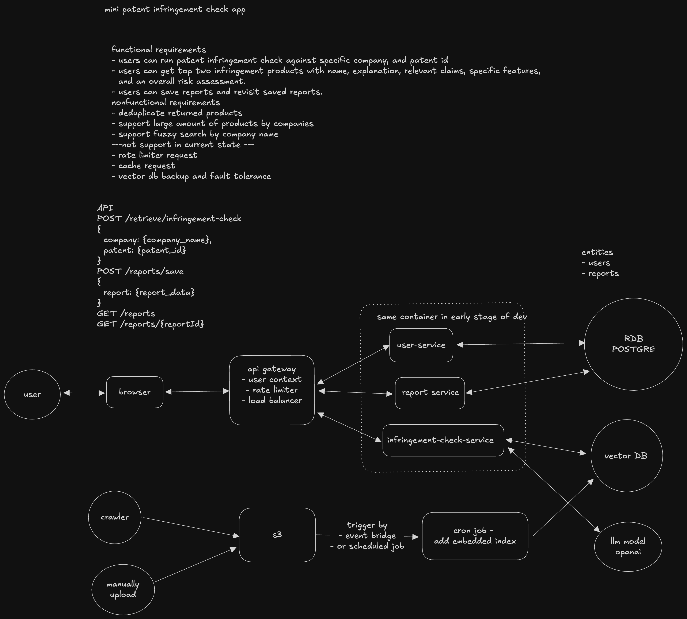

## mini patent infringement check app
## how to use
- docker compose watch
- frontend(http://localhost:5173)
- backend doc(http://localhost:8000/docs)
  - note, if you need to interact with the RAG API, you need to sign up user and paste JWT token
## System Design

## Task Break Down

### frontend
- infringement check page
- reports page

### backend
phase 0
- infringement check
  - [x] generate mock [products|patents]
  - [x] load and process [products|patents] to vector db
  - [x] retrieve [products|patents] by query
- save reports
  - [ ] save report
  - [ ] get saved reports

### infra
- [ ] set up AWS EC2
- [ ] deployment

